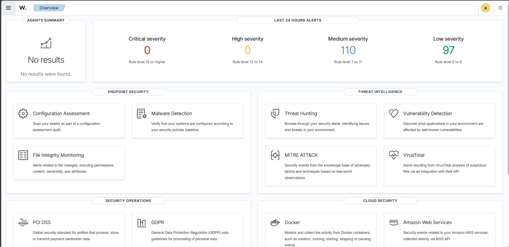
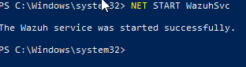
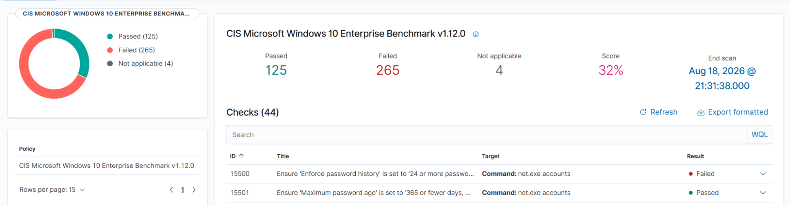
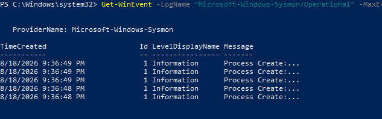
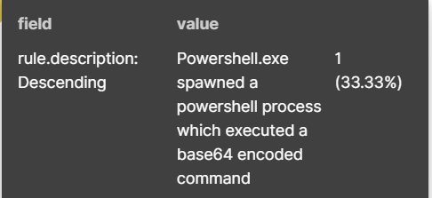

# Building my personal Security Operations Center (SOC)

## Introduction

A Security Information and Event Management (SIEM) system is a specialized piece of software that cybersecurity analysts and incident responders use to collect, analyze, and track security across an entire organization and its systems. Over the past few days, I have spent my time setting up my own Security Operations Center (SOC) around a Wazuh SIEM that takes in telemetry from a virtualized Windows 10 system equipped with Sysmon. I finally validated all of this with a live detection. This setup will act as the base for my other projects, where I shall attack the aforementioned setup and stress-test my SIEM.

## Phase 0: Lab Environment

The first step was to initialize all of my virtual machines. I used Oracle VirtualBox to host my machines. For this phase, I needed 2 systems:

1. **Ubuntu 22.04:** This virtual machine would host the actual Wazuh server. Any logs from the Windows system would first be fed in their raw form into this system, which would then be analyzed by Wazuh.

2. **Windows 10:** This virtual machine would send any and all logs to the Wazuh server on Ubuntu 22.04. This machine also hosts Sysmon or System Monitor, software that goes past normal Windows logging and tracks even the deepest nuances within the system such as process creations, network connections, file writes and so on.

To play it safe, I ensured both of these virtual machines had ample resources. My Ubuntu system has a base memory of 10259 MB, 4 processors and 50 GBs of storage. My Windows system similarly has a base memory of 8192 MB, 3 processors and 60 GBs of storage. Although you can set this up with less, I gave more than necessary to keep things smooth.

During the initialization of both these machines, I added 2 network adapters to both of them. The first one was connected to the VirtualBox host-only network (192.168.56.0/24) where DHCP was disabled and the machines were given a static IP: Ubuntu at 192.168.56.10 and Windows at 192.168.56.20. This process is the equivalent of connecting the two machines with an ethernet cable, while the static IPs ensure the connections never break from an address change. The second adapter was a normal Network Address Translation (NAT), giving my machines access to the Internet.

With all of the basic prerequisites completed, it was time to launch the machines and move on to Phase 1.

## Phase 1: Setting up Wazuh on Ubuntu

This step is just as simple. Installing Wazuh on Ubuntu was just a matter of opening the terminal and inputting two commands:

```bash
curl -sO https://packages.wazuh.com/4.x/wazuh-install.sh
```

This was responsible for the Wazuh installer being downloaded onto my machine. Think of it as downloading a .exe file. The curl command is a standard Linux command with the ability to transfer data from any network server to your own – or vice versa. The -sO can be split into -s and -O. -s just stops any progress meters and could be omitted if you were to implement your own rendition of this; however, the -O saves the downloaded file to your system under its original name, letting you run the installer. The link leads to the server where the installer is held.

```bash
sudo bash ./wazuh-install.sh -a
```

This actually runs the installer. sudo runs the command with the highest root administrative privileges, giving the installer unrestricted access to the operating system. bash specifies the shell to use, regardless of whatever the script has declared. ./ just specifies the current directory and wazuh-install.sh is the name of the installer inside of this directory. Finally, the -a is for all, which installs all of the components that are present in the installer on the machine. In this case, it would be the manager (component which receives all the logs), the indexer (database where the logs are stored) and dashboard (the web UI) on this one single machine.

After these two commands, I got the username and password that I could use to log into my Wazuh dashboard. I then verified this by logging onto https://192.168.56.10 on my host machine. Another successful phase done – on to the next.



## Phase 2: Setting up Sysmon and Wazuh on Windows

Now onto the Windows system. This phase is where everything comes together. I am now tasked with installing a Wazuh agent – something that forwards logs to my Wazuh server – and Sysmon – just a more in-depth log tracker. Both of these steps are also easily done by running PowerShell and inputting some commands.

1. **Wazuh Agent:** Thankfully, the Wazuh dashboard provides a very easy way to install agents. Wazuh provides a template command which you can slightly tweak and edit to fit your installation. However, you have to run it in PowerShell with admin privileges.

   ```powershell
   Invoke-WebRequest -Uri https://packages.wazuh.com/4.x/windows/wazuh-agent-<VERSION>.msi -OutFile ${env:TEMP}\wazuh-agent.msi; msiexec.exe /i ${env:TEMP}\wazuh-agent.msi /q WAZUH_MANAGER="<WAZUH_MANAGER_IP>" WAZUH_AGENT_NAME="<NAME>"
   ```

   I used this command to install my agent named win-endpoint onto my virtualized Windows. Afterwards, a simple NET START WazuhSvc runs the agent. My Windows is now officially on my Wazuh Dashboard.

   

   

2. **Sysmon:** Sysmon is a free Microsoft Sysinternals tool, and I paired it with the well-known SwiftOnSecurity configuration file. I used the same PowerShell terminal and typed in:

   ```powershell
   .\Sysmon64.exe -accepteula -i sysmonconfig.xml
   ```

   in order to get System Monitor on my machine. To check if this was working, I queried to get my recent logs on the system. Everything worked as intended.



Normally, the Wazuh agent does not look at the Sysmon log files. You have to configure it instead. So that's exactly what happened: I changed ossec.conf (the agent's configuration file) and made it forward the Microsoft-Windows-Sysmon/Operational event channel. I finally then restarted my agent and now all the pieces of the puzzle fit perfectly.

Now with the agent and the monitor installed, my SIEM is officially up and running. I shall test it in the next phase, but until then, this phase is over.

## Phase 3: Testing and Future

To properly check if my dashboard was working, I used a trick that attackers do: running PowerShell commands in base64, hiding the true command from a single glance at the log. I can use this feature to simulate an actual attack. I ran an encoded script on the Windows PowerShell.

```powershell
$cmd = 'Write-Output "lab detection test"'
$enc = [Convert]::ToBase64String([System.Text.Encoding]::Unicode.GetBytes($cmd))
powershell.exe -EncodedCommand $enc
```

These three lines are very easy to grasp. The first line stores "lab detection test" in a variable called $cmd, something that is completely harmless. The second line encodes this phrase into base64, a commonly used attack pattern. The third and final line then prints out this suspicious output through the `-EncodedCommand` flag. Hopefully this output is correctly registered by my agent.

After I went to my dashboard, I saw it clear as day: a high-severity alert that would ring alarm bells in any security analyst's mind. An actual alert showcasing suspicious activity was brought to my screen. Sysmon logged my suspicious command, my Wazuh agent forwarded it to my Ubuntu system, and the actual Wazuh server recognized the possibility of danger that was occurring. The SIEM is now functioning – my work has paid off.



My future plans are simple: use Kali Linux to attack the Windows machine, run real threats inside a safe and controlled environment and see what my SIEM catches – and what it doesn't catch, so that I can write my own rules to detect these gaps. This gives me experience on both sides: offense and defense. My next few updates will be on this exactly. I hope you found this helpful — follow along for more.
