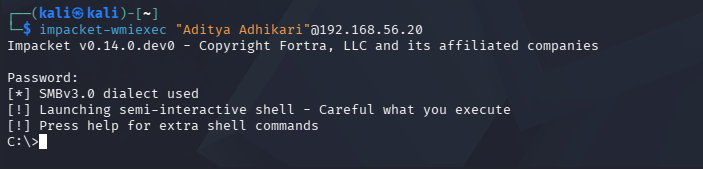
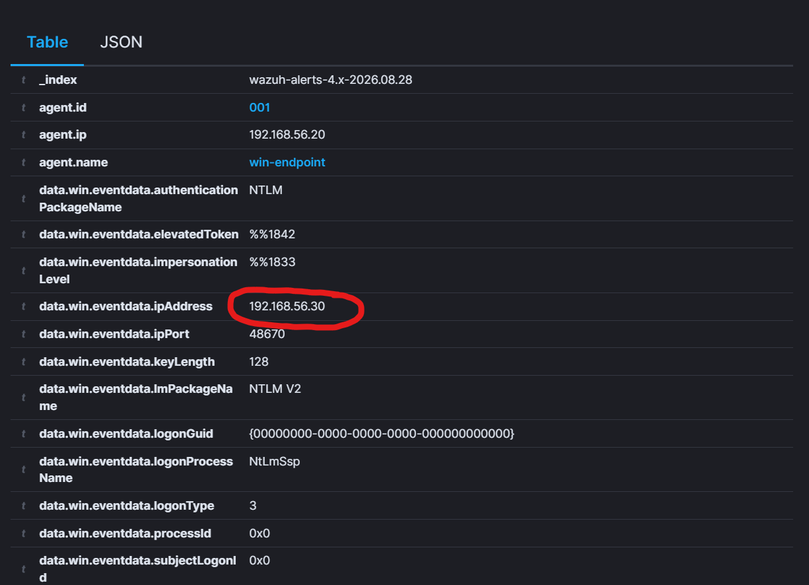
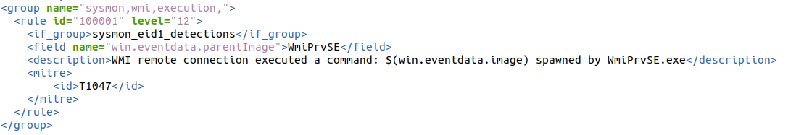
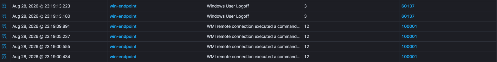
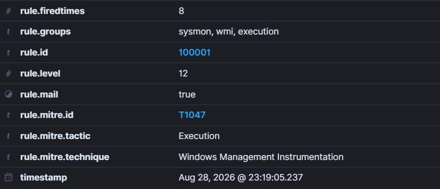

# Attack 0: Remote Access

ATT&CK ID: T1047  
Tactic: Execution

Let's now go forward with our attacks. However to do this, we must now gain remote control of the Windows endpoint through our Linux machine. Hence our attack 0 will be gaining access. We shall do this through a command – or more aptly, a python library – called impacket. 

Impacket is a library which uses network protocols like Server Message Block (SMB) – used to share files, printers and other resources between computers –, NT LAN Manager (NTLM) – used to authenticate user and computer identities over networks – and other various protocols. 

These are exactly what Windows itself uses to communicate over a network. I can use this library to speak these protocols and then execute any command I want using the Windows Management Instrumentation (WMI) – a system that allows users to query and manage Windows computers which allows me to get a shell from which I could interact with the system. This attack will let me gain access to the Windows system for my future attacks.



For the purpose of this attack, I had to change a lot of settings in order to make my Kali Linux connect. In a normal attack, this is very unlikely to happen. But for the sake of my learning, I changed a lot of rules:

1. Opened ports 135 and 445 – the exact ones responsible for connecting with impacket.

```
New-NetFirewallRule -DisplayName "Allow RPC EPM 135 (lab)" -Direction Inbound -Protocol TCP -LocalPort 135 -Action Allow -Profile Any

New-NetFirewallRule -DisplayName "Allow SMB 445 (lab)" -Direction Inbound -Protocol TCP -LocalPort 445 -Action Allow -Profile Any
```

2. Opened the ports that Distributed Component Object Model (DCOM) – a piece of software in Windows that allows for components on a system to communicate over a network.

```
New-NetFirewallRule -DisplayName "Allow DCOM dynamic (lab)" -Direction Inbound -Protocol TCP -LocalPort 49152-65535 -Action Allow -Profile Any
```

3. Disabled restrictions that make it so that users connecting remotely are stripped of administrative privileges which blocked its connection. This is actually an attack in itself.

```
New-ItemProperty -Path "HKLM:\SOFTWARE\Microsoft\Windows\CurrentVersion\Policies\System" -Name "LocalAccountTokenFilterPolicy" -Value 1 -PropertyType DWord -Force
```

The settings are the only ones I changed and they let me connect with Windows, without them no attack and no logs. Do not assume that you can recreate my commands without doing these first.

Now, with us connected, let’s see the dashboard.



There it is, our Kali Linux IP has been logged as one that remotely connected to our Windows endpoint, through NTLM and with elevated privileges. Our Wazuh has successfully seen our remote logon, our SIEM has caught the logon and authentication. Now let's explore by typing in a few basic commands.


Interestingly enough, my SIEM did not alert me on the commands. Now this seems like a lapse in the SIEM until you realize that if an actual administrator was remotely logging, our dashboard would bombard us with false-positives if it flagged every process that came through remote logons. 

So we have to work around this. We have to flag any command that is run by a user who connects through WMI. Most legitimate administrators use Remote Desktop Protocol (RDP), a WMI connection is rare and if it appears, it should be flagged and looked over once by the security team. So this is where my first rule comes in, something that informs Wazuh that processes whose parent is WmiPrvSE.exe – the parent process of commands spawned from a remote WMI connection.



Now to explain the rule I added onto my system:

1. \<group\> just puts labels and groups everything under umbrella terms. You can later use these labels in Wazuh to filter and search, making it easier for you.

2. “id=100001” and “level=12” are self explanatory, they contain the respective ID and threat level of the respective rules. Wazuh gives users id numbers past 100000 for their own custom rules.

3. \<if\_group\> is responsible for filtering out what the group would be. Sysmon logs process creations – like ones in cmd.exe – as event ID one, this gives our SIEM exactly what to look out for.

4. \<field\> is used to guide Wazuh to the field of parent image and check whether the parent process is WmiPrvSE.exe inside win.eventdata.parentImage.

5. \<mitre\> is used to give our new custom rule its proper ATT&CK ID.

Now let’s log back onto Kali and mess around with the Windows system.  


Checking back in with the Wazuh Dashboard and there we have it:





Our rule has been successfully logged and alerted to us on the dashboard. 

A thing to mention is that crafting and troubleshooting this event ID took me a long amount of time. Between checking if we were meant to use Sysmon’s event ID for process creation or Wazuh’s to accidentally write the wrong group name, this was an extremely tedious task. However, in the end it was worth it and my final result is a working custom rule for Wazuh SIEM made by myself.

With attack 0 out of the way, our attacker has gained access to the system. Now with the beginning of attack 1, he will scope out the system he has. Follow along here.
