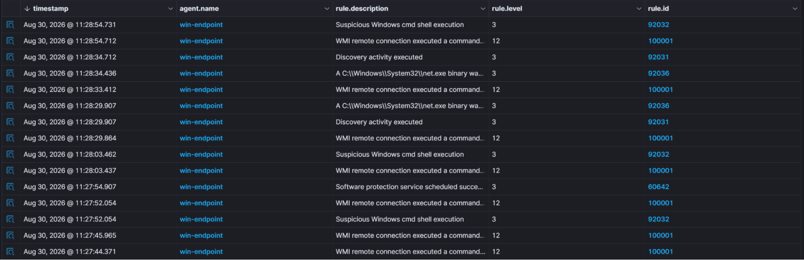
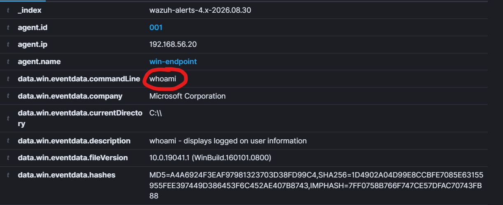
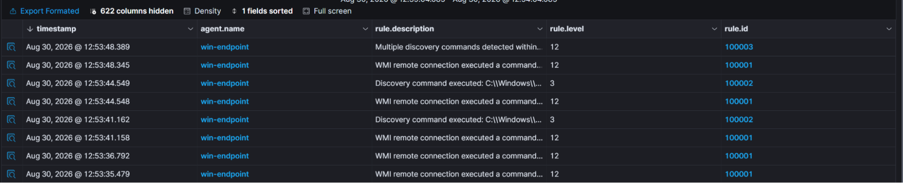
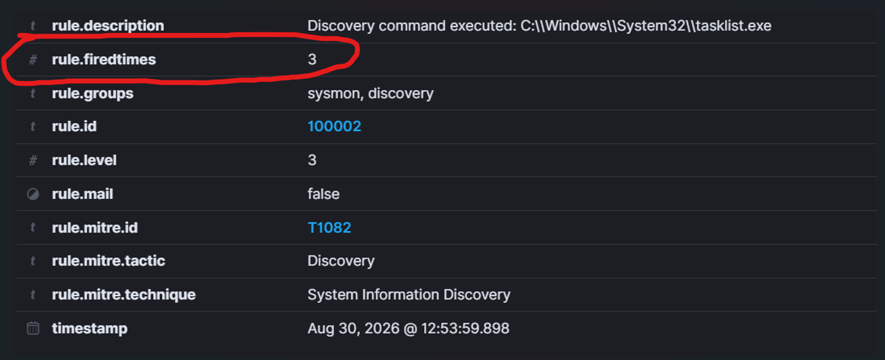
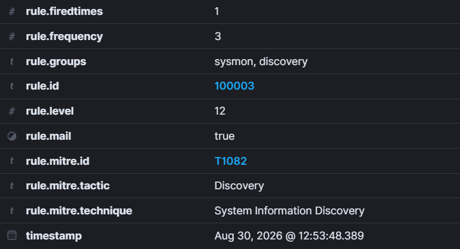

# Attack 1: System Information Discovery

ATT&CK ID: T1082  
Tactic: Discovery

Remote access has been achieved. A wide range of techniques can be utilized. But first, we as the attacker must have a general idea of where we are working. Our first attack does exactly this, giving us an idea of where we are. We achieve this by simple means: systeminfo, whoami, ipconfig, etc. These commands give us information about the system from the operating system version all the way to the IP address of the machine. Knowing basic information about the system can discover ways to conceal future attacks and develop payloads. This attack lets me know what I am using and how I should proceed.

Let's run a few of these discovery commands. For my example, I ran

```
systeminfo
whoami /all
ipconfig /all
net user
tasklist
```

With all of these commands, let's see the output on my dashboard.



Interesting to note is that there are certain rules definitely in place to note whether discovery commands run, they are only kept at a security level of 3.



If an actual attacker were to run these commands, the team would never notice it since it is not at a high security level. So my custom rule for this would be to send a higher level of alert if these discovery commands are used at a higher frequency by any singular system.

```xml
<group name="sysmon,discovery,">

  <rule id="100002" level="3">
    <if_group>sysmon_eid1_detections</if_group>
    <field name="win.eventdata.image" type="pcre2">(?i)(systeminfo|whoami|ipconfig|tasklist|hostname|netstat|net1?|nltest)\.exe</field>
    <description>Discovery command executed: $(win.eventdata.image)</description>
    <mitre>
        <id>T1082</id>
    </mitre>
  </rule>

  <rule id="100003" level="12" frequency="3" timeframe="30">
    <if_matched_sid>100002</if_matched_sid>
    <description>Multiple discovery commands detected within a short period of time</description>
    <mitre>
        <id>T1082</id>
    </mitre>
  </rule>

</group>
```

Now you might observe that there are actually 2 rules I have made here. The first rule (100002) is the rule used for detection of discovery commands. The syntax of the rule is similar to the one I put for attack 0, so let me just highlight the changes and additions in this rule.

1. "name=win.eventdata.image" and "type=pcre2". The name is changed from parent name since we are not searching for the parent process here — if we were, it would be WmiPrvSE.exe — but instead we are searching for the actual process that ran. pcre2 is a small tool to help us pattern match or use regular expressions (regex). Things like (?i) — to ignore case/capitalization – and using the | (or) to search for the process would not work without pcre2.

Rule 100003 actually alerts us of any possible discovery attacks. If rule 100002 is violated 3 or more times within 30 seconds then our dashboard will flag with a level 12 high severity alert. The syntax I use is explained below:

1. "frequency" and "timeframe" are self explanatory, if the rule condition is met for a set frequency during a set timeframe, only then will an alert be generated

2. \<if_matched_sid\> is used instead of the \<if_group\> that I used previously because of the frequency tag. Firstly, we need to call our previously generated rule 100002 as that entirely is responsible for noticing discovery commands.

   matched is specially used for frequency. You can think of it as a count which keeps track of the frequency. Without it, the rule would run always as it would never note how many times the rule has been flagged within a time period.

With our custom rules officially set in place, let's now experiment and see if it detects as it is meant to.







My rules work as intended. Executing 3 or more discovery commands within 30 seconds sends a level 12 alert to my dashboard. Now if any attacker were to try and find out information about my system, they would be flagged almost immediately.

This rule does have limitations, if an attacker spaces out their commands by 30 seconds then this will not be able to detect them, this is a limitation of this custom rule which I unfortunately had to accept.

With my custom rules now officially in place for discovery attacks, let's move onto [attack 2: Downloading Malware](../Attack%202:%20Downloading%20Malware/README.md).
