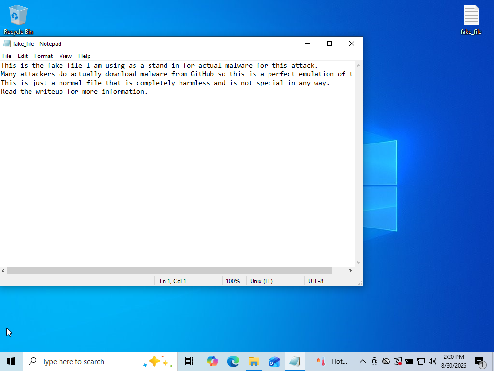
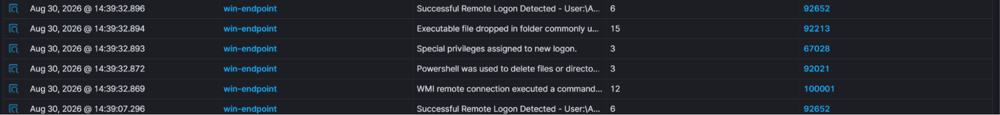
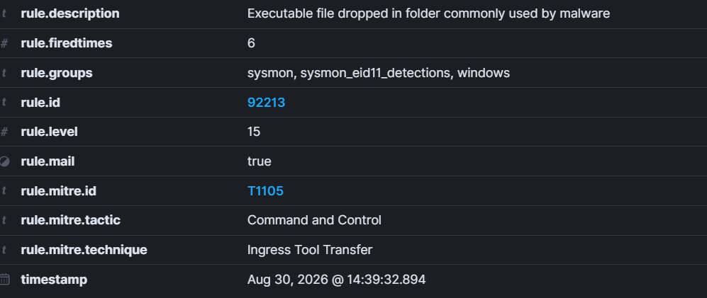
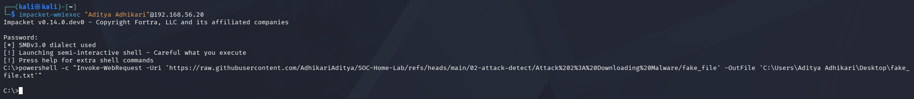
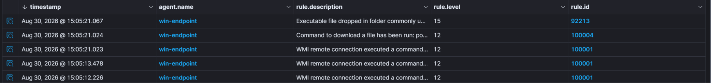

# Attack 2: Downloading Malware

ATT&CK ID: T1105  
Tactic: Command and Control

Now the attacker is on the system, his next step would be to download additional software on the system to deepen his hold on it. Attackers can use commands to download malicious files which can be executed on the system, resulting in a system wide compromise. Moreover, if the malware spreads, an entire company wide cybersecurity breach is at risk. I plan to download an innocuous file on my Windows endpoint through the Kali system and observe the results on my dashboard.

For this attack, I have created my own malware called ["fake_file"](./fake_file). I use the term malware, however this file is just a simple txt file with 3 lines of text. Lets first download this on the system and see what occurs. I download this by running the command below on PowerShell.

```
powershell -c "Invoke-WebRequest -Uri 'https://raw.githubusercontent.com/AdhikariAditya/SOC-Home-Lab/refs/heads/main/02-attack-detect/Attack%202%3A%20Downloading%20Malware/fake_file' -OutFile 'C:\Users\Aditya Adhikari\Desktop\fake_file.txt'"
```



As you can see, the file has been downloaded, now let's look at our dashboard.





Luckily, Wazuh appears to have noticed this with its own rule 92213. But upon closer inspection, this rule only detects files being handled in sensitive locations; our desktop being one of them. Nothing is actually identifying the fact that a file has been downloaded from the internet, rather, a separate incorrect rule 92021 was violated. 92021 is a rule that's called when a file or directory is deleted. The exact opposite is happening here. So lets craft our own custom rule to detect when a file is being downloaded from PowerShell.

```xml
<group name="sysmon,command,control,malware,">

  <rule id="100004" level="12">
    <if_group>sysmon_eid1_detections</if_group>
    <field name="win.eventdata.commandLine" type="pcre2">(?i)(Invoke-WebRequest|curl|wget|IWR|DownloadString|DownloadFile|Net.WebClient|Start-BitsTransfer)</field>
    <description>Command to download a file has been run: $(win.eventdata.commandLine)</description>
    <mitre>
        <id>T1105</id>
    </mitre>
  </rule>

</group>
```

Now this rule is similar to the rule implemented in attack 0. If any commands or cmd-lets are run which are responsible for downloading something, this rule will be flagged and we shall immediately be alerted. Let's test this out on our Kali Linux system and check our dashboard.





And there we have it, our new rule successfully flags us if any downloads are occurring from the terminal. Our rule has been successfully implemented and now attackers cannot download their own tools without the dashboard lighting up.

Next attack, we shall see how Wazuh interacts with [LSASS credential dumping](../Attack%203:%20LSASS%20Dumping/README.md).
