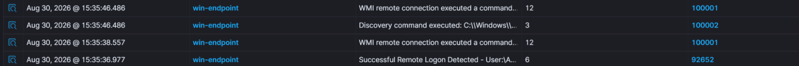
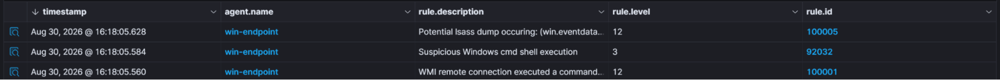

# Attack 3: LSASS Credential Dumping

ATT&CK ID: T1003.001  
Tactic: Credential Access

Local Security Authority Subsystem Service (LSASS) is a core Windows system process. It is in charge of anything security related, from logins to permissions. It does this by storing sensitive credentials in the memory. Intentionally causing a LSASS dump could reveal log in details and Kerberos tickets – digital tokens which are used to prove the identity of a user without the need of repeated password inputs – in a system. This incredibly useful and important process is obviously a high-value target for any attackers. So for our third attack, we will be causing a LSASS credential dump, where password hashes and at times, passwords themselves are all given to the attacker.

Before I even start on the actual commands that were executed. I first made sure LSASS logs were being shipped in the first place. Sysmon, more specifically SwiftOnSecurity — which is the Sysmon configuration I am using — does not ship logs related to LSASS by default. So I changed configurations to ship these logs.

The command I used to cause an LSASS dump is:

```
rundll32.exe C:\windows\system32\comsvcs.dll, MiniDump 692 C:\Users\Public\lsass.dmp full
```

Luckily, Windows Defender already blocks this command by default. Checking on our dashboard, there is no alert.



This is again a major gap in our ruleset. Even if Windows Defender blocks the dump, our SOC should still alert us that a system tried to cause a dump. So let's fix this with our own custom rule.

```xml
<group name="sysmon,credential_access,lsass,">

  <rule id="100005" level="12">
    <if_group>sysmon_event_10</if_group>
    <field name="win.eventdata.targetImage" type="pcre2">(?i)lsass\.exe</field>
    <field name="win.eventdata.grantedAccess" type="pcre2">(?i)0x1010|0x1410|0x143a|0x1438|0x1FFFFF</field>
    <description>Potential lsass dump occuring: (win.eventdata.targetImage)</description>
    <mitre>
        <id>T1003.001</id>
    </mitre>
  </rule>

</group>
```

Again this rule is similar to the rule used in attack 0. The name="win.eventdata.grantedAccess" line might appear to have a string of gibberish. Values like 0x1010 and 0x1410 include the right to read another process's memory, which is exactly what a credential-dumping tool must request to extract passwords from LSASS. Normal processes don't read LSASS memory, if a dump is occurring then it is due to a potential attacker. This line was specifically used to filter out actual authorized processes against an attacker's attempt.

For the sake of testing my rule, I did in fact turn off Windows Defender. Let's now test out the rule in action:




Our custom rule works. Another interesting thing to note is that Wazuh actually does have a rule in place for LSASS dumping, rule 92900 does cover this exact scenario but for 0x1010 and 0x40 only. It does not cover 0x1FFFFF like my one does and that is why nothing was being flagged when a full LSASS dump happened.

Now with LSASS dumps secure, let's move onto [attack 4: scheduled tasks](../Attack%204:%20Scheduled%20Task/README.md).
