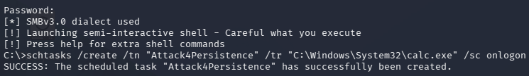
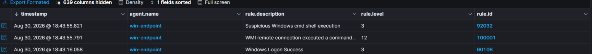
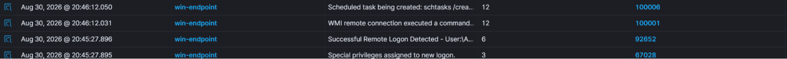
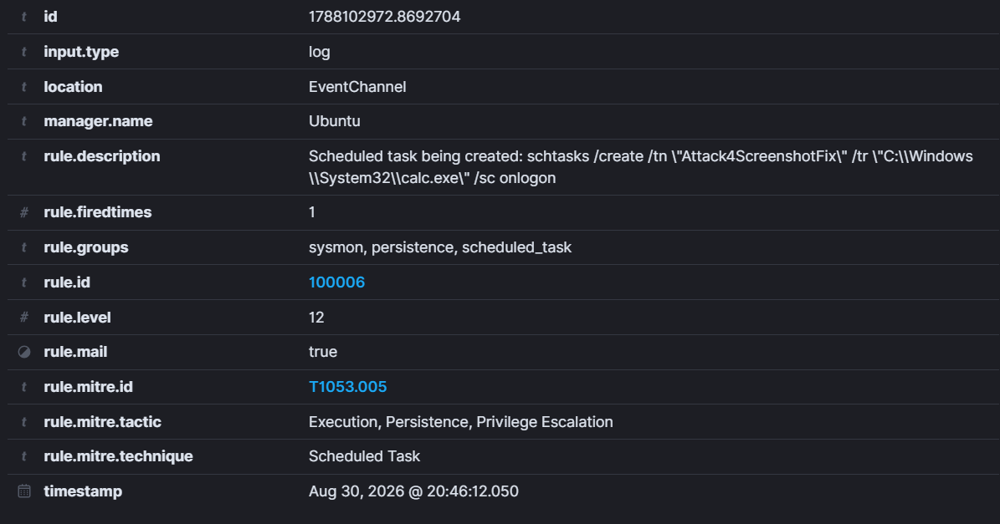
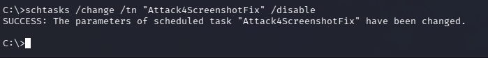
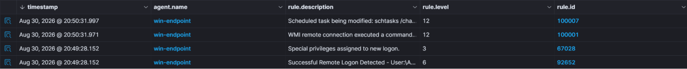
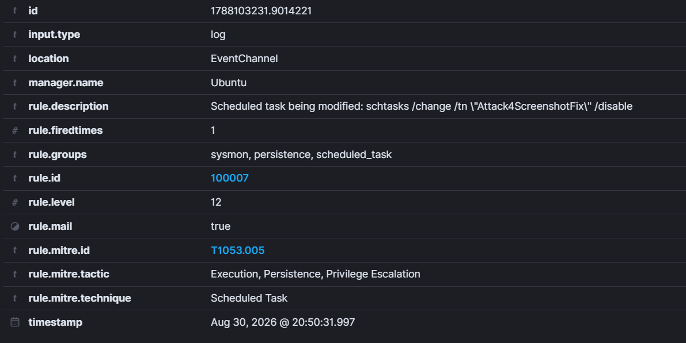
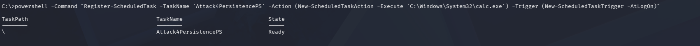
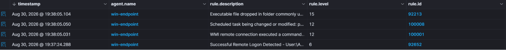
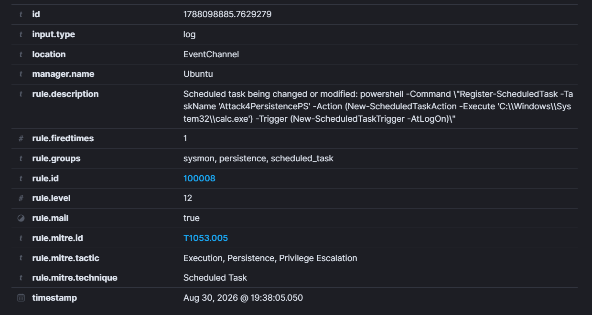

# Attack 4: Scheduled Task

ATT&CK ID: T1053.005  
Tactic: Persistence

Once attackers have gotten access to a system, they need to maintain access and control to that system. A way they do this is by creating scheduled tasks. As the name suggests, scheduled tasks are any commands or functions which are executed at a specified moment. For example, an attacker could create a scheduled task to reinstall malware at set intervals, making it so that even if an update or a virus scan detects the malware once, it will persist thanks to the scheduled task. This attack will showcase exactly what the Wazuh dashboard will tell us when a scheduled task is created.

So let's begin by creating our very own scheduled task.

```
schtasks /create /tn "Attack4Persistence" /tr "C:\Windows\System32\calc.exe" /sc onlogon
```

This creates a very simple scheduled task called Attack4Persistence which runs our calculator program on logon. Let's run it and check the output.






Our Wazuh has successfully logged our scheduled task creation, however, its severity level is at level 3. If an attacker were to schedule an actual malicious scheduled task which redownloaded malware, then this would've registered it under a lower severity level and not even as a persistence attack. So that's where our gap lies and my custom rule arrives.

```xml
<group name="sysmon,persistence,scheduled_task,">

  <rule id="100006" level="12">
    <if_group>sysmon_eid1_detections</if_group>
    <field name="win.eventdata.image" type="pcre2">(?i)schtasks\.exe</field>
    <field name="win.eventdata.commandLine" type="pcre2">(?i)/create</field>
    <description>Scheduled task being created: $(win.eventdata.commandLine)</description>
    <mitre>
        <id>T1053.005</id>
    </mitre>
  </rule>

  <rule id="100007" level="12">
    <if_group>sysmon_eid1_detections</if_group>
    <field name="win.eventdata.image" type="pcre2">(?i)schtasks\.exe</field>
    <field name="win.eventdata.commandLine" type="pcre2">(?i)/change</field>
    <description>Scheduled task being modified: $(win.eventdata.commandLine)</description>
    <mitre>
        <id>T1053.005</id>
    </mitre>
  </rule>

  <rule id="100008" level="12">
    <if_group>sysmon_eid1_detections</if_group>
    <field name="win.eventdata.image" type="pcre2">(?i)powershell\.exe</field>
    <field name="win.eventdata.commandLine" type="pcre2">(?i)(Register-ScheduledTask|New-ScheduledTask)</field>
    <description>Scheduled task being changed or modified: $(win.eventdata.commandLine)</description>
    <mitre>
        <id>T1053.005</id>
    </mitre>
  </rule>

</group>
```

For this attack, I have created 3 extremely similar custom rules. Our custom rules are just like most others we have made. There are two main conditions: if the commands inside the "name=win.eventdata.image" are executed and if it is with the /create or the /change tag, then rules 100006 or 100007 will be violated respectively and we will be alerted. If someone were to create scheduled tasks through PowerShell then it means that they will violate 100008 and we will be alerted there too, covering all of our bases. 100006 is the main rule we were after, but 100007 prevents attackers from changing preexisting tasks and modifying it to their benefit, 100008 stops attackers from bypassing cmd and working through PowerShell.

After we create another task, we can check our dashboard.





Rule 100006 works as intended. Now to try rule 100007:













Perfect, all three work. Now no matter where an attacker creates a new task or updates a preexisting one, we can see it on our dashboard with a high severity level. However, this does have some issues. If a legitimate user creates tasks, then it means that we would be alerted. However, legitimate users do not have a tendency of creating scheduled tasks and the chances of false positives is low. However, legitimate softwares do, and this is where my rule would generate a lot of noisy false positives.

Now that the attacker can't even persist on our computer, it is time to make sure that even if he tries to wipe the board clean, we can track him there as well. Let's do that in our last and final attack: [attack 5](../Attack%205:%20Indicator%20Removal/README.md).
