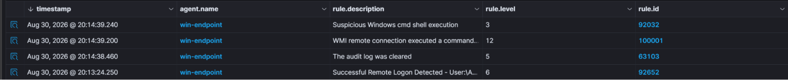
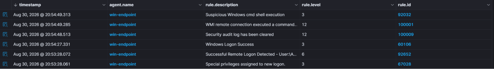
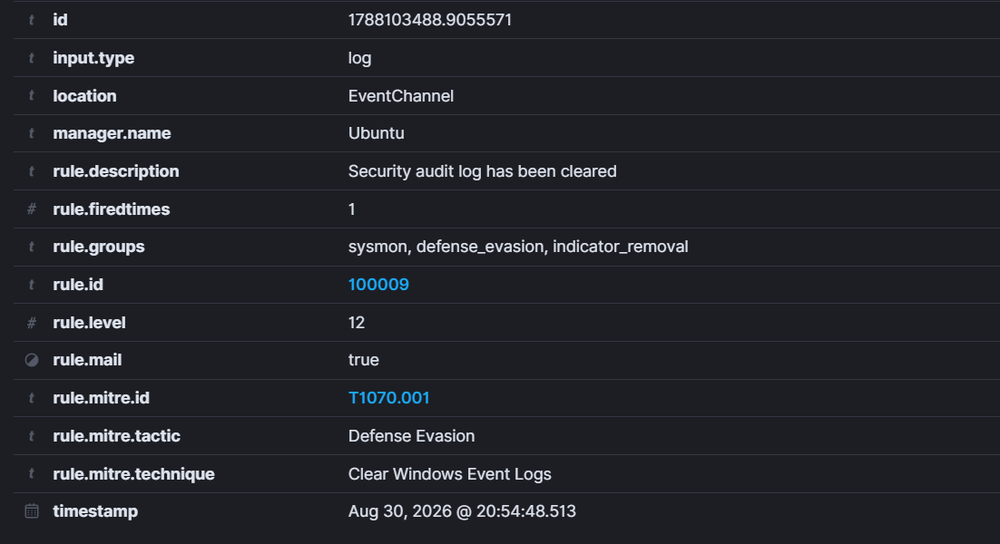

# Attack 5: Indicator Removal

ATT&CK ID: T1070.001  
Tactic: Defense Evasion

Stealth is the utmost priority of any attacker. If you are caught then you start again back at square one. So what some attackers do is remove any traces of their presence. Logs, application history, terminal history – all of these could feasibly prove that an attacker was present, and all of these are targeted and wiped to hide their digital footprint. The final attack will now be the attacker hiding their existence and presence and observing how the SIEM and Sysmon react when all logs are deleted.

Let's run the command to delete log files

```
wevtutil cl Security
```



Now we can see that there is no high severity alert for any of these. No legitimate user would ever delete security logs, so these are only for attackers. So our custom rule should cover this gap.

```xml
<group name="sysmon,persistence,scheduled_task,">

  <rule id="100009" level="12">
    <if_sid>63108</if_sid>
    <description>Security audit log has been cleared</description>
    <mitre>
        <id>T1053.001</id>
    </mitre>
  </rule>

</group>
```

Our final custom rule has been finalized. Now, to test it:





The final custom rule for this project: 100009 is now up and ready. From checking remote access, discovery attacks, downloading from an external server, dumping LSASS credentials, scheduling tasks and finally deleting audit logs. I have made my own Secure Operations Center (SOC) at home with my own custom rules. This has been an extremely difficult process and project, however I have come through with a deeper understanding into blue team work and how to manage a SIEM and put my own custom rules. This has truly helped me greatly improve my skills and I plan to do more in the future. Feel free to follow my GitHub for more updates. 

If you are free, please check out my [File Integrity Manager](https://github.com/AdhikariAditya/FileIntegrityManager).
