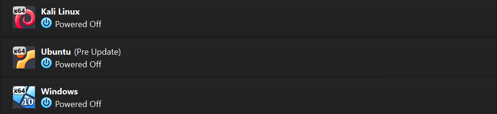

# Attacking my personal Security Operations Center (SOC)

## Introduction

Previously, I built my SOC by installing Wazuh SIEM on an Ubuntu virtual machine and installing a Wazuh Agent on a Windows endpoint fitted with Sysmon — full details can be found [here](https://github.com/AdhikariAditya/SOC-Home-Lab/blob/main/01-lab-build/01-lab-build-readme.md). But setting a SIEM up is only half the picture, the other half would be actually using it. So that is what my plan is here: the second part of my SOC home lab will involve attacking my Windows endpoint with a Kali Linux virtual machine, understanding all the various logs that arrive at my SIEM dashboard and finally implementing any custom rules to cover any attacks that the SIEM might have missed or did not alert properly.

## Phase 0: Lab Environment

Just like how I did initially when setting my home lab, I once again had to set up a Kali Linux machine. Kali Linux is vital for this part of my project since it is the machine I will use as an attack platform. I will pretend to be an attacker who already has a compromised system – in my case the Windows endpoint – and conduct attacks.  Essentially, my Windows endpoint has already been breached by the Kali Linux machine. The good part about this is that I had already set up Kali Linux when getting into cybersecurity. But for the sake of teaching anyone who might not already have it — simply download the ISO from the official Kali website and boot it up the way you would boot any other virtualized system. I ensured that the host-only network adapter was configured properly and my Kali Linux was ready to be used.

## Phase 1: Attacks

| Number | Technique | ATT&CK ID | Tactic |
| - | - | - | - |
| [0](./Attack%200:%20Remote%20Access/README.md) | Remote Access | T1047 | Execution |
| [1](./Attack%201:%20System%20Information%20Discovery/README.md) | System Information Discovery | T1082 | Discovery |
| [2](./Attack%202:%20Downloading%20Malware/README.md) | Downloading Malware | T1105 | Command and Control |
| [3](./Attack%203:%20LSASS%20Dumping/README.md) | LSASS Credential Dumping | T1003.001 | Credential Access |
| [4](./Attack%204:%20Scheduled%20Task/README.md) | Scheduled Task | T1053.005 | Persistence |
| [5](./Attack%205:%20Indicator%20Removal/README.md) | Indicator Removal | T1070 | Defense Evasion |

All of these attacks tell a clear story. Attack 0 where an attacker first gains remote access, the following attack shows how he surveys the system he is on. Proceeding to attack 2, the attacker downloads his own tools and software. Afterwards, he steals credentials in attack 3. Finally in attacks 4 and 5, the attacker ensures that they have continued control over the system and that no one can notice their presence.

## Conclusion

This is a way for me to develop my blue team abilities by giving me the closest thing I have to a full detection cycle; all the way from generating the telemetry to writing custom rules. I hope you found this helpful, if you have time then please check out my other project, a file integrity manager right [here](https://github.com/AdhikariAditya/FileIntegrityManager).
